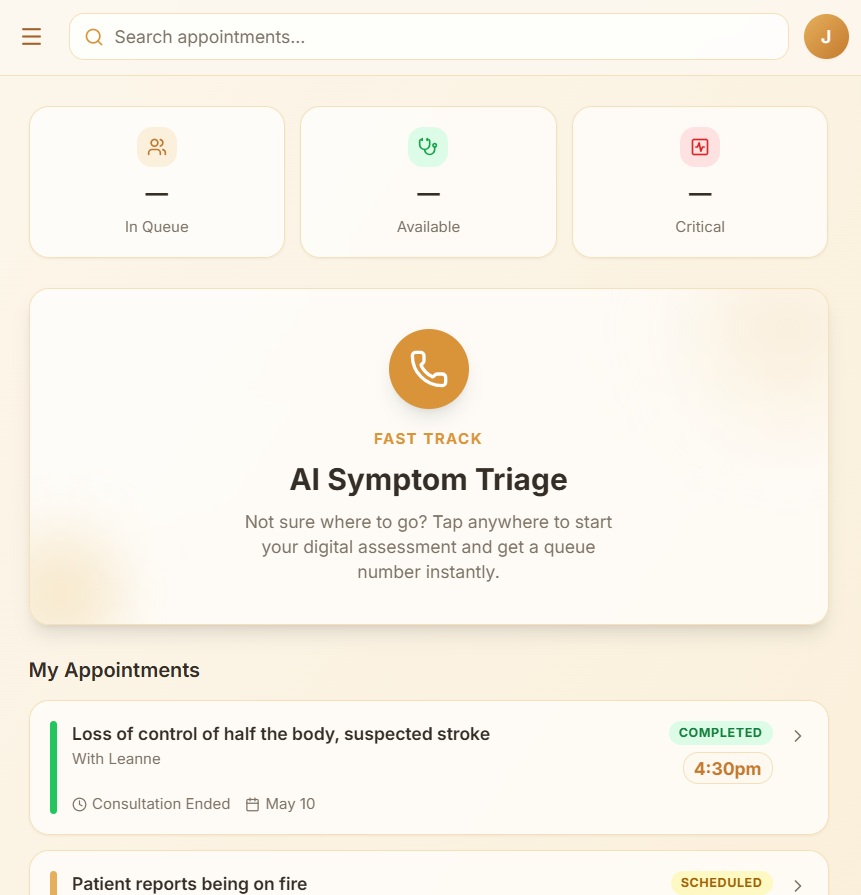
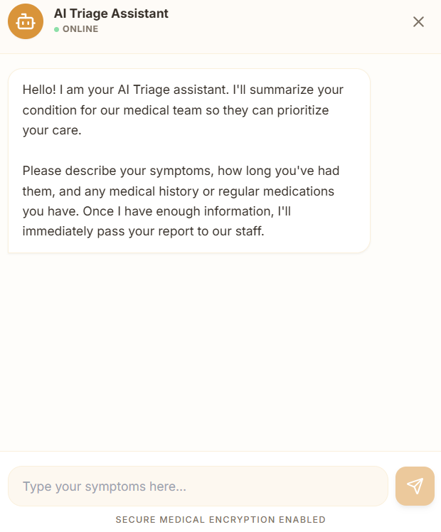
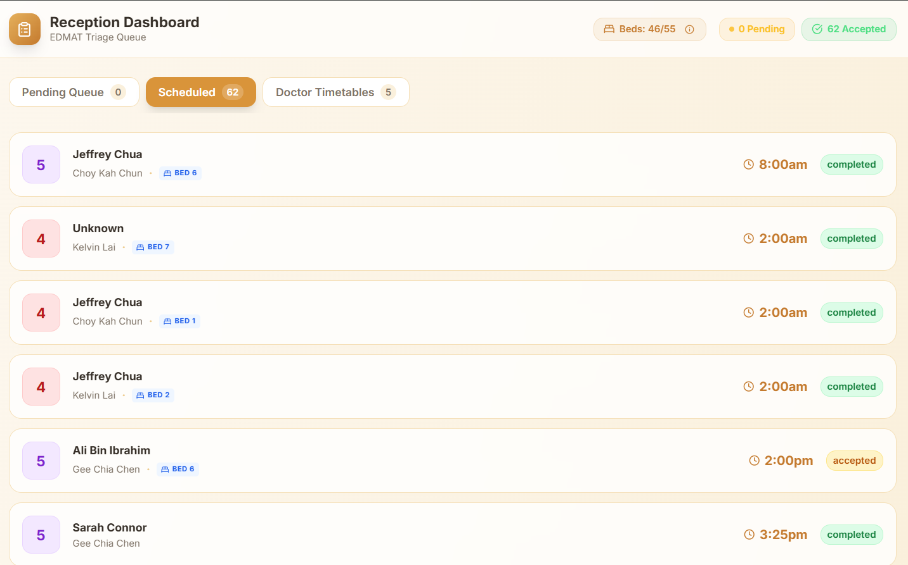
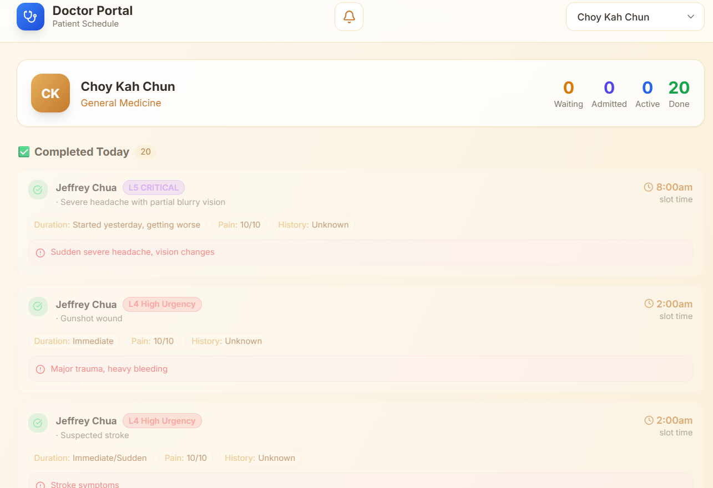
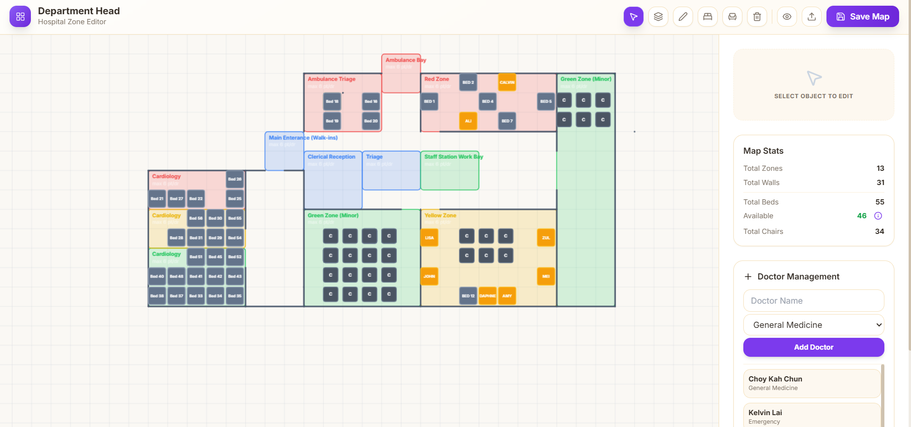

# MediQueue 

**Never wait in a hospital lobby again!! Register now, Come Later!!**

MediQueue is a healthcare optimization designed to eliminate overcrowded hospital waiting rooms. By leverating AI-driven triage scoring, real-time queue management, and interactive dashboards for medical staff, MediQueue allows patients to arrive **exactly when it's their turn**, transforming the stressful hospital waiting experience into a streamlined, automated workflow. 

## The Problem & The Solution
* **The Problem:** 
Traditional ERs and clinics suffer from severe overcrowding, long waiting times, and inefficient triaging. Patients with minor ailments waits for hours next to highly infectious individuals, while medical staff are overwhelmed by manual intake.

* **The Solution:**
MediQueue automates the intake process with an AI Chatbot that determines a clinical triage score. Patients are dynamically queued and notified of their estimated treatment time, enabling them to wait safely and comfortably at home until summoned.

## Key Features

### 1. AI-Driven Patient Triage (ChatBot)
* patients interacts with an intelligent, conversational AI Chatbot upon opening the app.
* The chatbot gathers symptoms, medical history, and vital signs to determine an initial **Triage Score** based on standard clinical guidelines.

### 2. Receptionist Review & Verification Dashboard
* AI Results and Triage scores are instantly forwarded to a centralized dashboard for the hospital receptionist for confirmation.
* Receptionist can review, modify and approve the AI's assessment to ensure the correct scoring.
* After confirmation, patients will be placed into the queueing system.

### 3. Dynamic Real-Time Queueing & Notification System
* Once approved, the system places the patient into a live, priotized queue.
* The app updates in real-time, displaying the patient's current position, estimated wait time, and a status tracker.
* The queueing system implements an **Urgency Score** which is **patient time waiting** * **

### 4. Unified Doctors Portal

* **Doctor View:** Clear View of upcoming appointments and schedules.
* 

* **Head Department View:** Clear View of occupied beds across the hospital. Can dynamically change hospital zones to accomodate overflow.

## Team Members
* **Jeffrey Chua** || **Choy Kah Chun** || **Yeak Li Ying** || **Kelvin Lai** || **Teo Yong Yi**
